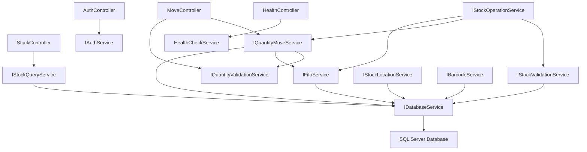
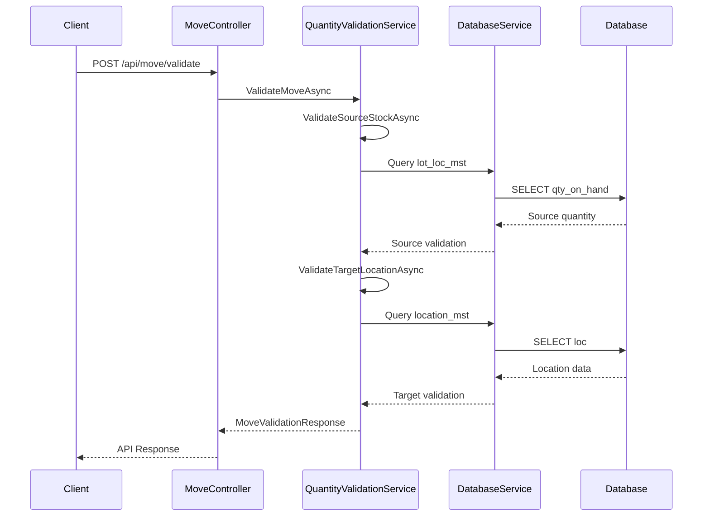
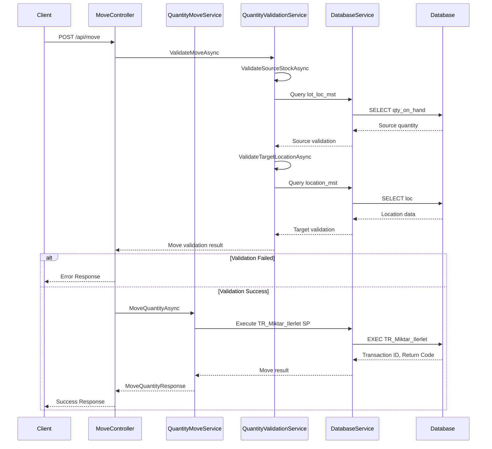
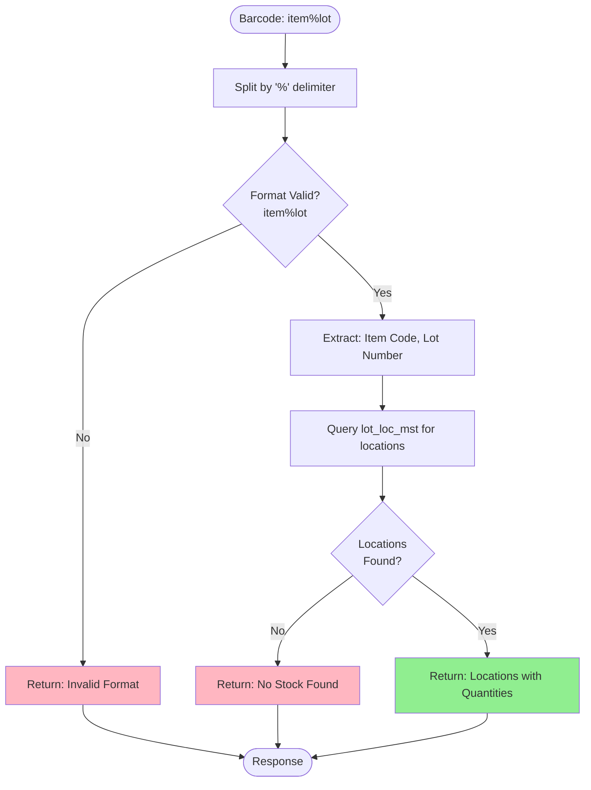

# Quantity Move API - Complete Documentation
//prod ip 10.0.100.97
## Table of Contents
1. [Architecture Overview](#architecture-overview)
2. [API Methods List](#api-methods-list)
3. [Service Architecture](#service-architecture)
4. [Workflows](#workflows)
5. [Design Principles](#design-principles)

---

## Architecture Overview

The Quantity Move API follows a **modular architecture** with clear separation of concerns. Each service has a single responsibility, and methods are focused on specific tasks rather than being overloaded with multiple responsibilities.

### High-Level Architecture

```
┌─────────────────────────────────────────────────────────────┐
│                      API Controllers                         │
│  ┌──────────┐  ┌──────────┐  ┌──────────┐  ┌──────────┐   │
│  │  Stock   │  │   Move   │  │   Auth   │  │  Health  │   │
│  │Controller│  │Controller│  │Controller│  │Controller│   │
│  └────┬─────┘  └────┬─────┘  └────┬─────┘  └────┬─────┘   │
└───────┼─────────────┼─────────────┼─────────────┼─────────┘
        │             │             │             │
        ▼             ▼             ▼             ▼
┌─────────────────────────────────────────────────────────────┐
│                    Service Layer                            │
│  ┌──────────────┐  ┌──────────────┐  ┌──────────────┐    │
│  │ Stock        │  │ Quantity     │  │ FIFO         │    │
│  │ Services     │  │ Services     │  │ Service      │    │
│  │              │  │              │  │              │    │
│  │ - Query      │  │ - Move       │  │ - Validation │    │
│  │ - Validation │  │ - Validation │  │ - Summary    │    │
│  │ - Location   │  │              │  │              │    │
│  └──────────────┘  └──────────────┘  └──────────────┘    │
│                                                             │
│  ┌──────────────┐  ┌──────────────────────────────────┐  │
│  │ Barcode      │  │ Composition Service               │  │
│  │ Service      │  │ (Combines multiple services)    │  │
│  └──────────────┘  └──────────────────────────────────┘  │
└─────────────────────────────────────────────────────────────┘
        │
        ▼
┌─────────────────────────────────────────────────────────────┐
│                  Database Service Layer                     │
│  ┌────────────────────────────────────────────────────┐   │
│  │         DatabaseService (Dapper)                   │   │
│  │  - Stored Procedure Execution                      │   │
│  │  - Query Execution                                 │   │
│  └────────────────────────────────────────────────────┘   │
└─────────────────────────────────────────────────────────────┘
        │
        ▼
┌─────────────────────────────────────────────────────────────┐
│                      SQL Server Database                    │
│  - lot_loc_mst (Lot Location Inventory)                    │
│  - item_mst (Item Master)                                   │
│  - location_mst (Location Master)                          │
│  - lot_mst (Lot Master)                                     │
│  - TRM_FIFO_SUM (FIFO Summary - legacy)                    │
│  - TRM_EDIUSER (User Authentication - legacy)              │
│  - employee_mst (Employee Master)                          │
└─────────────────────────────────────────────────────────────┘
```

---

## API Methods List

### Stock Controller (`/api/stock`)

| Method | Endpoint | Description | Parameters |
|--------|----------|-------------|------------|
| `GET` | `/api/stock/{barcode}` | Get stock locations and quantities by barcode | `barcode` (route parameter, format: `item_code%lot_num`) |

**Barcode Format**: `item_code%lot_num` (e.g., `"ITEM123%LOT456"`)

**Response**: Returns all locations with stock for the item/lot combination.

### Move Controller (`/api/move`)

| Method | Endpoint | Description | Request Body |
|--------|----------|-------------|--------------|
| `POST` | `/api/move/validate` | Validate if a move operation is allowed | `MoveValidationRequest` |
| `POST` | `/api/move` | Execute a move operation (includes automatic validation) | `MoveQuantityRequest` |

**Move Endpoint Behavior**:
- Automatically validates the move before execution
- Calls `TR_Miktar_Ilerlet` stored procedure to perform the move
- Returns transaction ID and status

### Auth Controller (`/api/auth`)

| Method | Endpoint | Description | Request Body |
|--------|----------|-------------|--------------|
| `POST` | `/api/auth/login` | Authenticate user and get JWT token | `LoginRequest` |

**Authentication**: Public endpoint (no authentication required). Returns JWT token for subsequent API calls.

### Health Controller (`/api/health`)

| Method | Endpoint | Description | Parameters |
|--------|----------|-------------|------------|
| `GET` | `/api/health` | Basic health check (service is running) | None |
| `GET` | `/api/health/ready` | Readiness check (service is ready to accept requests) | None |
| `GET` | `/api/health/live` | Liveness check (service is alive) | None |

**Authentication**: All health endpoints are public (no authentication required).

---

## Service Architecture

### Service Layer Breakdown

```
IStockService (Core Stock Operations)
├── IStockQueryService (Read Operations)
│   ├── GetQuantityAtLocationAsync
│   ├── GetLocationsForItemLotAsync
│   ├── GetStockSummaryAsync
│   └── GetCurrentLocationAsync
│
├── IStockValidationService (Validation Operations)
│   ├── ValidateItemAsync
│   ├── ValidateLotAsync
│   ├── ValidateLocationAsync
│   ├── ValidateStockAvailabilityAsync
│   └── ValidateStockForMoveAsync (Composition)
│
└── IStockLocationService (Location-Specific Operations)
    ├── GetLocationsWithStockAsync
    ├── GetLocationsWithoutStockAsync
    └── GetLocationDetailsAsync

IQuantityService (Quantity Movement)
├── IQuantityMoveService (Move Operations)
│   ├── MoveQuantityAsync
│   ├── MoveQuantityWithValidationAsync (Composition)
│   └── MoveQuantityWithFifoCheckAsync (Composition)
│
└── IQuantityValidationService (Pre-Move Validation)
    ├── ValidateSourceStockAsync
    ├── ValidateTargetLocationAsync
    └── ValidateMoveAsync (Composition)

IFifoService (FIFO Operations)
├── GetOldestLotAsync
├── ValidateFifoComplianceAsync
└── GetFifoSummaryAsync

IBarcodeService (Barcode Operations)
├── ParseBarcodeAsync
└── LookupBarcodeAsync

IStockOperationService (Composition Service)
└── MoveQuantityWithFullValidationAsync
    (Combines: Validation + FIFO + Move)
```

### Service Dependencies



---

## Workflows

### 1. Move Validation Workflow

**Purpose**: Validate that a move operation is allowed before execution.



**Steps**:
1. **Validate Source Stock**: Check if source location has sufficient quantity
2. **Validate Target Location**: Ensure target location exists and is valid
3. **Return Result**: Return validation status with error message if invalid

---

### 2. Quantity Move Workflow

**Purpose**: Move quantity from source to target location with automatic validation.



**Steps**:
1. **Automatic Validation**: Validate move before execution
2. **Source Validation**: Verify source has sufficient stock
3. **Target Validation**: Verify target location is valid
4. **Execute Move**: Call `TR_Miktar_Ilerlet` stored procedure to perform the move
5. **Return Result**: Provide transaction ID and status

---

### 3. Stock Lookup by Barcode Workflow

**Purpose**: Get stock locations and quantities by parsing barcode.



**Barcode Format**: `item_code%lot_num`
- Example: `ITEM123%LOT456`
- Returns all locations with stock for the item/lot combination

---

## Design Principles

### 1. Single Responsibility Principle
Each service and method has one clear purpose:
- **StockQueryService**: Only read operations
- **StockValidationService**: Only validation logic
- **QuantityMoveService**: Only move operations

### 2. Small Parameter Lists
Methods accept maximum 3-4 parameters, using request DTOs for complex operations:
- ✅ `GetQuantityAtLocationAsync(itemCode, lotNumber, locationCode, warehouseCode)`
- ✅ `ValidateStockForMoveAsync(StockMoveValidationRequest request)`

### 3. Composition Over Configuration
Complex operations are built by composing smaller methods:
- `MoveQuantityWithValidationAsync` = `ValidateMoveAsync` + `MoveQuantityAsync`
- `MoveQuantityWithFifoCheckAsync` = `ValidateFifoComplianceAsync` + `MoveQuantityWithValidationAsync`

### 4. Focused Services
Services are separated by domain concern:
- **Stock Services**: Inventory queries and validation
- **Quantity Services**: Movement operations
- **FIFO Service**: FIFO-specific logic
- **Barcode Service**: Barcode parsing

### 5. Query Objects Pattern
Request DTOs replace long parameter lists:
```csharp
// Instead of:
Task<Response> Method(string p1, string p2, string p3, string p4, bool p5, int p6);

// We use:
Task<Response> Method(GetLocationsRequest request);
```

### 6. Strategy Pattern
Different strategies for different scenarios:
- Simple move: `MoveQuantityAsync`
- Move with validation: `MoveQuantityWithValidationAsync`
- Move with FIFO: `MoveQuantityWithFifoCheckAsync`

---

## Service Explanations

### StockQueryService
**Purpose**: Read-only operations for stock information.

**Methods**:
- `GetQuantityAtLocationAsync`: Returns quantity at a specific location
- `GetLocationsForItemLotAsync`: Lists all locations for an item/lot combination
- `GetStockSummaryAsync`: Provides summary statistics for an item
- `GetCurrentLocationAsync`: Finds current location(s) where item/lot exists

**Use Cases**: Stock inquiries, location lookups, inventory reports

---

### StockValidationService
**Purpose**: Validation logic for stock operations.

**Methods**:
- `ValidateItemAsync`: Checks if item exists and is lot-tracked
- `ValidateLotAsync`: Verifies lot number exists
- `ValidateLocationAsync`: Validates location exists and returns type
- `ValidateStockAvailabilityAsync`: Checks if sufficient quantity available
- `ValidateStockForMoveAsync`: Combined validation for move operations

**Use Cases**: Pre-operation validation, error prevention

---

### StockLocationService
**Purpose**: Location-specific queries.

**Methods**:
- `GetLocationsWithStockAsync`: Returns locations with available stock
- `GetLocationsWithoutStockAsync`: Returns locations where item/lot exists but qty = 0
- `GetLocationDetailsAsync`: Returns detailed location information

**Use Cases**: Location selection, location validation, stock distribution analysis

---

### QuantityMoveService
**Purpose**: Quantity movement operations.

**Methods**:
- `MoveQuantityAsync`: Basic move operation (calls stored procedure)
- `MoveQuantityWithValidationAsync`: Move with pre-validation
- `MoveQuantityWithFifoCheckAsync`: Move with FIFO compliance check

**Use Cases**: Inventory transfers, location moves, production movements

---

### QuantityValidationService
**Purpose**: Pre-move validation.

**Methods**:
- `ValidateSourceStockAsync`: Ensures source has sufficient quantity
- `ValidateTargetLocationAsync`: Ensures target location is valid
- `ValidateMoveAsync`: Combined source and target validation

**Use Cases**: Pre-move checks, error prevention

---

### FifoService
**Purpose**: FIFO (First-In-First-Out) operations.

**Methods**:
- `GetOldestLotAsync`: Retrieves oldest lot for an item
- `ValidateFifoComplianceAsync`: Checks if current lot violates FIFO
- `GetFifoSummaryAsync`: Returns FIFO summary for an item

**Use Cases**: FIFO compliance, lot selection, inventory aging

---

### BarcodeService
**Purpose**: Barcode parsing and lookup.

**Methods**:
- `ParseBarcodeAsync`: Parses barcode string (item%lot%quantity format)
- `LookupBarcodeAsync`: Looks up item information from barcode

**Use Cases**: Mobile scanning, barcode input processing

---

### StockOperationService (Composition)
**Purpose**: Combines multiple services for complex workflows.

**Methods**:
- `MoveQuantityWithFullValidationAsync`: Complete validation + move operation

**Use Cases**: High-level operations requiring multiple validations

---

## Request/Response Models

### Key Request Models

**GetQuantityRequest**
```json
{
  "item_code": "ABC123",
  "lot_number": "LOT001",
  "location_code": "LOC001",
  "warehouse_code": "WHSE01"
}
```

**MoveQuantityRequest**
```json
{
  "item_code": "ABC123",
  "source_location": "LOC001",
  "source_lot_number": "LOT001",
  "target_location": "LOC002",
  "quantity": 100.50,
  "warehouse_code": "WHSE01",
  "site_reference": "SITE01",
  "document_number": "DOC123"
}
```

**MoveValidationRequest**
```json
{
  "item_code": "ABC123",
  "lot_number": "LOT001",
  "source_location": "LOC001",
  "target_location": "LOC002",
  "quantity": 100.50,
  "warehouse_code": "WHSE01"
}
```

**LoginRequest**
```json
{
  "username": "user123",
  "password": "password123"
}
```

### Key Response Models

**MoveValidationResponse**
```json
{
  "is_valid": true,
  "error_message": null
}
```

**MoveQuantityResponse**
```json
{
  "success": true,
  "transaction_id": 12345,
  "return_code": 0,
  "error_message": null
}
```

**LocationsResponse** (Stock by Barcode)
```json
{
  "item_code": "ITEM123",
  "lot_number": "LOT456",
  "locations": [
    {
      "location_code": "LOC001",
      "quantity": 100.50
    },
    {
      "location_code": "LOC002",
      "quantity": 50.25
    }
  ]
}
```

**LoginResponse**
```json
{
  "token": "eyJhbGciOiJIUzI1NiIsInR5cCI6IkpXVCJ9...",
  "expires_in": 86400,
  "user": {
    "user_id": "hash_of_username",
    "username": "user123",
    "full_name": "John Doe",
    "email": null,
    "warehouse": "MAIN"
  }
}
```

---

## Database Tables

### Core Tables

- **lot_loc_mst**: Lot location inventory (quantities by location)
- **item_mst**: Item master data (item definitions, lot tracking flag)
- **location_mst**: Location master (location definitions, types)
- **lot_mst**: Lot master (lot definitions, creation dates)
- **TRM_FIFO_SUM**: FIFO summary (oldest lots per item/warehouse) - **legacy table name**
- **TRM_EDIUSER**: User authentication table - **legacy table name**
- **employee_mst**: Employee master data

**Note**: The API uses legacy database table names for compatibility with the existing production database. See **[DATABASE_INTEGRATION.md](DATABASE_INTEGRATION.md)** for complete database documentation.

### Stored Procedures

- **TR_Stok_Kontrol**: Validates stock availability and lot tracking - **legacy stored procedure**
- **TR_Miktar_Ilerlet**: Performs quantity movement between locations - **legacy stored procedure**

**Stored Procedure Parameters**:
- `TR_Miktar_Ilerlet`: `@Item`, `@loc1`, `@lot1`, `@loc2`, `@qty`, `@DocumentNum`
- `TR_Stok_Kontrol`: `@Item`, `@Lot`, `@Location`, `@Whse`

---

## Error Handling

All endpoints return standardized `ApiResponse<T>` format:

**Success Response**:
```json
{
  "success": true,
  "data": { ... },
  "message": "Operation completed successfully"
}
```

**Error Response**:
```json
{
  "success": false,
  "data": null,
  "message": "Error description",
  "errors": ["Error detail 1", "Error detail 2"]
}
```

---

## Authentication

All endpoints require JWT authentication via `[Authorize]` attribute.

**Authentication Flow**:
1. Client requests token from `/api/auth/login`
2. Server returns JWT token
3. Client includes token in `Authorization: Bearer <token>` header
4. Server validates token on each request

---

## Summary

The Quantity Move API provides a **modular, focused architecture** with:

- **5 API endpoints** across 4 controllers:
  - Stock: 1 endpoint (barcode lookup)
  - Move: 2 endpoints (validate, move)
  - Auth: 1 endpoint (login)
  - Health: 3 endpoints (health, ready, live)
- **9 service interfaces** with clear responsibilities:
  - Stock: Query, Validation, Location services
  - Quantity: Move, Validation services
  - FIFO: Compliance and summary services
  - Barcode: Parsing and lookup services
  - Composition: StockOperationService
- **Request/response models** with focused parameters
- **Composition patterns** for complex operations
- **Comprehensive validation** at multiple levels
- **Legacy database compatibility** (TRM_EDIUSER, TRM_FIFO_SUM, TR_Miktar_Ilerlet, TR_Stok_Kontrol)
- **Barcode integration** for mobile scanning (item%lot format)

The architecture emphasizes:
- ✅ Single Responsibility
- ✅ Small Method Signatures
- ✅ Composition Over Configuration
- ✅ Clear Separation of Concerns
- ✅ Easy Testing and Maintenance
- ✅ Legacy Database Compatibility

**Database Integration**: The API is designed to work with the existing legacy database schema. See **[DATABASE_INTEGRATION.md](DATABASE_INTEGRATION.md)** for complete database documentation including table structures, stored procedure parameters, and verification checklist.

